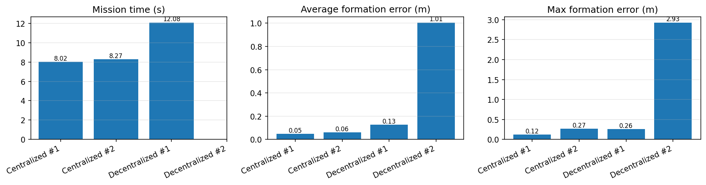
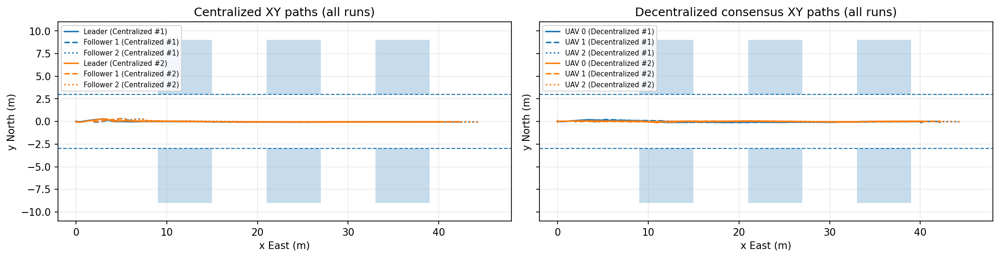
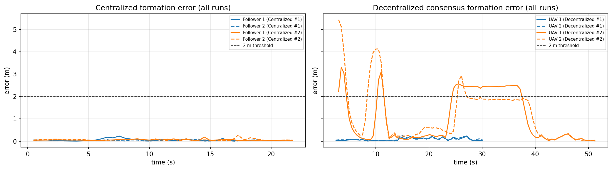
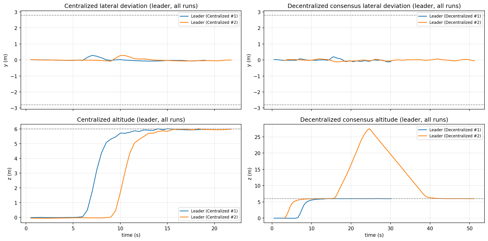

## Agentic Multi-UAV Coordination

This project simulates **three UAVs** in a known corridor scenario and compares two coordination architectures:

- **Centralized control:** one ROS2 controller computes the mission route and formation setpoints for all UAVs.
- **Decentralized consensus baseline:** each UAV runs a local controller, computes its own formation target from the shared waypoint plan, and advances waypoints using peer readiness messages.

The goal is to evaluate both approaches under the same **Gazebo/PX4/ROS2/Docker** setup using:

- Mission success
- Mission time
- Average formation error
- Maximum formation error

The benchmark **top-level** trials complete the corridor mission; the analysis notebook and figures also pick up **extra** run folders under `uav_eval/` (for example nested copies after `docker cp`). On the checked-in data, centralized runs stay fast and accurate; one duplicate decentralized folder fails metrics while the primary decentralized run still passes.

## Technology Roles

| Technology | Role |
|---|---|
| Docker Compose | Starts the complete reproducible stack. |
| Gazebo | Simulates the 3D world, UAV models, and corridor environment. |
| PX4 SITL | Runs one simulated flight controller per UAV. |
| Micro XRCE-DDS Agent | Bridges each PX4 instance to ROS2 topics. |
| ROS2 Jazzy | Runs the Python control and evaluation nodes. |
| `px4_msgs` | Provides ROS2 message types for PX4 offboard control. |
| Python | Implements centralized control, decentralized control, metrics, and experiment runner. |
| Groq / LLM | Optional interactive mission/formation generation in `llm_agent.py`; not used in the reproducible corridor comparison. |

## Main Components

| Path | Purpose |
|---|---|
| `src/llm_agent.py` | Centralized controller and optional interactive LLM demo. |
| `src/decentralized_agent.py` | Per-UAV local controllers for the decentralized consensus baseline. |
| `src/experiment_runner.py` | Headless runner for centralized/decentralized corridor trials. |
| `src/metrics.py` | Shared pass/fail and metric computation. |
| `src/scenario.py` | Shared corridor, spawn, frame, and threshold constants. |
| `src/formation_flight.py` | Formation helpers, waypoint progress, and formation-error math. |
| `docker/inject_obstacle_into_default_world.py` | Injects corridor buildings into PX4's default Gazebo world. |
| `scripts/start_px4_multi.sh` | Starts the three PX4 SITL UAVs. |
| `uav_eval_analysis.ipynb` | Executed notebook with result tables and plots. |

## Scenario

The experiment is a **known-map corridor** task:

- Three UAVs start in line formation.
- The shared mission plan moves the formation through a corridor along positive `x`.
- Each UAV computes its assigned formation target from the current shared waypoint and its fixed offset.
- Buildings are injected into Gazebo as two rows of obstacles with a gap around `y=0`.
- Planning and evaluation use Gazebo ENU coordinates: `x` East, `y` North, `z` Up.
- Cruise altitude is `z=+6 m`.

This project does **not** add SLAM or real camera/LiDAR perception. It focuses on coordination/control architecture under a fixed simulated environment.

## Reproduce The Evaluation

Run commands from the repo root in WSL:

```bash
cd ~/uav-project-devops
```

### Terminal 1: Clean Start

```bash
rm -rf ./uav_eval ./uav_eval_centralized ./uav_eval_decentralized ./uav_eval_failed
docker compose down --remove-orphans
docker container prune -f
docker builder prune -f
```

### Terminal 1: Build And Start

Rebuild `ros2` whenever Python files change, then start the full stack:

```bash
docker compose build ros2
docker compose up -d --force-recreate px4 dds_0 dds_1 dds_2 ros2
```

Wait about 3 minutes for PX4/Gazebo/DDS startup.

### Terminal 2: Centralized Trial

```bash
docker exec -it ros2_agent bash
source /opt/ros/jazzy/setup.bash
source /ros2_ws/install/setup.bash
rm -rf /tmp/uav_eval
python3 /scripts/experiment_runner.py \
  --mode centralized \
  --scenario corridor \
  --log-dir /tmp/uav_eval/centralized \
  --no-llm
```

Expected:

```text
Wrote /tmp/uav_eval/centralized/pose.csv
Wrote /tmp/uav_eval/centralized/summary.json
mission_success=True
```

### Terminal 1: Copy Centralized Results

Copy before restarting, because `/tmp` is inside the container:

```bash
mkdir -p ./uav_eval
docker cp ros2_agent:/tmp/uav_eval/centralized ./uav_eval/centralized
python3 -m json.tool ./uav_eval/centralized/summary.json
```

### Terminal 1: Restart For Decentralized

```bash
docker compose down --remove-orphans
docker compose up -d --force-recreate px4 dds_0 dds_1 dds_2 ros2
```

Wait about 3 minutes again.

### Terminal 2: Decentralized Trial

```bash
docker exec -it ros2_agent bash
source /opt/ros/jazzy/setup.bash
source /ros2_ws/install/setup.bash
python3 /scripts/experiment_runner.py \
  --mode decentralized \
  --scenario corridor \
  --log-dir /tmp/uav_eval/decentralized \
  --no-llm
```

Expected:

```text
Wrote /tmp/uav_eval/decentralized/pose.csv
Wrote /tmp/uav_eval/decentralized/summary.json
mission_success=True
```

### Terminal 1: Copy Decentralized Results

```bash
docker cp ros2_agent:/tmp/uav_eval/decentralized ./uav_eval/decentralized
python3 -m json.tool ./uav_eval/decentralized/summary.json
```

### Terminal 1: Verify Files

```bash
ls -R ./uav_eval
```

Expected:

```text
./uav_eval/centralized/pose.csv
./uav_eval/centralized/summary.json
./uav_eval/decentralized/pose.csv
./uav_eval/decentralized/summary.json
```

## Results

Figures and numbers below match the **current** `uav_eval/` tree and `docs/figures/*.png` produced by `uav_eval_analysis.ipynb` (run from the repo root). The notebook discovers **every** folder under each mode that contains both `summary.json` and `pose.csv`, and labels runs **Centralized #1**, **Centralized #2**, **Decentralized #1**, **Decentralized #2** (numbering restarts per architecture).

| Plot label | Run folder | Mission success | Mission time | Avg formation error | Max formation error | Failure reasons |
|---|---|---:|---:|---:|---:|---|
| Centralized #1 | `uav_eval/centralized/` (top-level) | True | 8.02 s | 0.047 m | 0.123 m | none |
| Centralized #2 | `uav_eval/centralized/centralized/` | True | 8.27 s | 0.060 m | 0.268 m | none |
| Decentralized #1 | `uav_eval/decentralized/` (top-level) | True | 12.08 s | 0.126 m | 0.260 m | none |
| Decentralized #2 | `uav_eval/decentralized/decentralized/` | False | n/a | 1.006 m | 2.929 m | goal + corridor + formation threshold |

**Primary benchmark (single folder per mode after a clean `docker cp`):** compare **Centralized #1** vs **Decentralized #1**—both succeed; centralized finishes in about **8 s** with lower formation error than decentralized at about **12 s**.

**Duplicate nested folders:** **Centralized #2** is another successful centralized trial with slightly higher time and formation error than **Centralized #1**. **Decentralized #2** does **not** meet mission success (corridor violation, formation error above **2 m**, leader did not reach the final waypoint with valid formation). That shows how an extra copied run can pass or fail independently; use the notebook table if your tree differs.

The PNGs under `docs/figures/` include **all** discovered runs. Re-run the Docker experiments, copy `uav_eval/`, then execute the notebook to refresh CSV/JSON and figures.



Interpretation:

- **Metric comparison:** each of the three panels (mission time, average / max formation error) has one bar per discovered run. The failed **Decentralized #2** trial shows no mission time and large errors versus the **2 m** cap (see table).
- **Centralized vs decentralized (top-level):** one global controller yields shorter mission time and smaller formation error than the decentralized consensus baseline on the same corridor.
- **Centralized #1 vs #2:** both pass; the second nested copy is a bit slower and looser in formation—typical run-to-run variation in simulation.
- **Decentralized #1 vs #2:** the primary decentralized run passes under the **2 m** formation cap; the nested duplicate fails thresholds—use it as a reminder to align folder layout with intended trials, not as the main baseline.
- **XY / formation-error / altitude plots:** colors match **Plot label** (`Centralized #n`, `Decentralized #n`). Formation-error traces cross the dashed **2 m** line when a run fails the aggregate criteria.

## Trajectory And Safety Plots

These plots are generated by `uav_eval_analysis.ipynb` and saved to `docs/figures/` for the README (same numbering as the results table).

The **XY paths** figure overlays each numbered run per mode (e.g. **Centralized #1** and **Centralized #2** use distinct colors; **Decentralized #1** vs **Decentralized #2** likewise). Line styles separate Leader from followers within a run.



The **formation-error** figure plots follower error vs time per run; the dashed **2 m** line is the pass/fail cutoff. Failed runs (here **Decentralized #2**) show errors climbing beyond that band.



The **altitude / lateral** figure plots **leader** paths only when multiple runs are present, one curve per **Centralized #n** / **Decentralized #n**, with horizontal guides near the corridor and cruise altitude **z = 6 m**.



## Notebook Analysis

Open the notebook for interactive plots and report-ready figures:

```bash
uav_eval_analysis.ipynb
```

Run it from the repository root so paths resolve to `./uav_eval/`. The notebook loads **every** run under each mode: any directory that contains both `summary.json` and `pose.csv` (top-level `uav_eval/<mode>/` plus nested subfolders, e.g. after `docker cp` duplicates). Plots overlay those trials and export PNGs to `docs/figures/` (`metric_comparison.png`, `xy_paths.png`, `formation_error.png`, `altitude_lateral.png`) for version control and this README.

It contains:

- Summary table (one row per discovered run, with **Plot label** matching charts: `Centralized #1`, `Decentralized #2`, …)
- Metric comparison charts across all runs (same numbering)
- XY trajectory plots (all runs overlaid per mode)
- Formation-error plots (all runs)
- Altitude/lateral-deviation plots (leader only when comparing multiple runs)
- Final conclusions

## Optional Interactive LLM Demo

The original interactive centralized agent is still available:

```bash
docker exec -it ros2_agent bash
source /opt/ros/jazzy/setup.bash
source /ros2_ws/install/setup.bash
python3 /scripts/llm_agent.py
```

Useful menu options:

- `5`: fixed corridor mission without LLM
- `6`: triangle formation plus corridor mission
- `1` / `2` / `3`: LLM-assisted formation/mission generation if `GROQ_API_KEY` is configured

Create `.env` only if using the LLM path:

```bash
GROQ_API_KEY=your_key_here
```

## Cleanup

After saving results:

```bash
docker compose down --remove-orphans
docker container prune -f
docker builder prune -f
```

More aggressive cleanup if disk is full:

```bash
docker system prune -af --volumes
docker builder prune -af
```

On Windows, reclaim WSL/Docker disk space after cleanup:

```powershell
wsl --shutdown
```

Then compact Docker's VHDX from an Administrator `diskpart` session if needed.

## Project Conclusion

This project compares centralized and decentralized consensus coordination in the same simulated corridor, with metrics and plots driven by `uav_eval_analysis.ipynb`. **Centralized #1** and **Decentralized #1** (top-level folders) both complete the mission within thresholds; centralized is faster and more accurate. Additional folders such as **Centralized #2** and **Decentralized #2** illustrate repeat trials or duplicate `docker cp` layouts—some match the baseline, others can fail independently (**Decentralized #2** on the current snapshot).

The trade-off remains: one centralized controller owns mission and formation setpoints; the decentralized consensus baseline relies on shared waypoints and peer readiness, which in the primary run succeeds but with longer time and higher formation error.

Overall, the workflow stays reproducible: Dockerized simulation, scripted experiments, JSON/CSV logs, pass/fail rules in `metrics.py`, and report-ready figures under `docs/figures/` tied to numbered plot labels in the notebook.
